# 5. Ключевые экраны

Снимки сделаны 29.09.2026 в веб-сборке прототипа (https://lugertr.github.io/fin-pet/, коммит `ac2cec9`) в окне 390×844 dp, как у типичного Android-смартфона. В обычном профиле: питомец «Бублик», робот в оранжевом облике, цель — диван. Для финала их нужно заменить снимками с Android-устройства: они же пойдут в карточку RuStore, где нужно не меньше трёх скриншотов.

> В рабочей копии после снимков уже есть незакоммиченные правки интерфейса. В комнате подписи «Работа» и «Копилка» вместо «Смена» и «Банк». Вкладка «Хаб» стоит первой, у «Копилки» иконка-свинья. Из шапки убрана цветная полоска. На вкладку «Копилка» ведут и подписи в комнате. После коммита снимки стоит переснять.

## 5.1. Создание питомца (Прил. А, шаги 2–3; ТЗ 2.5.1–2.5.2)

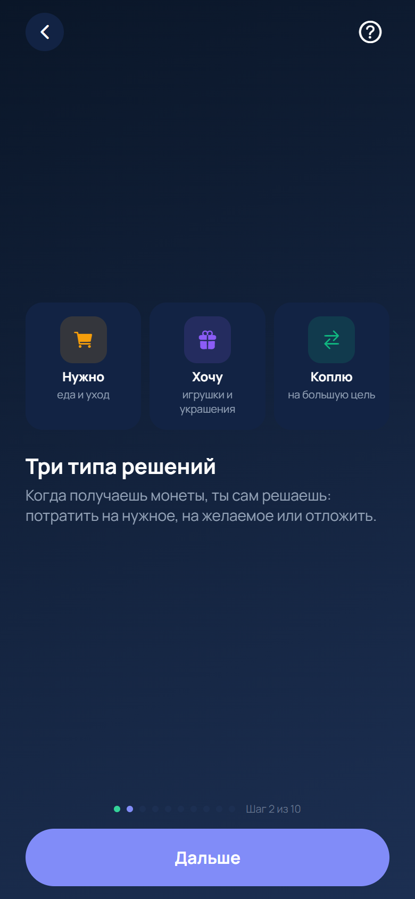
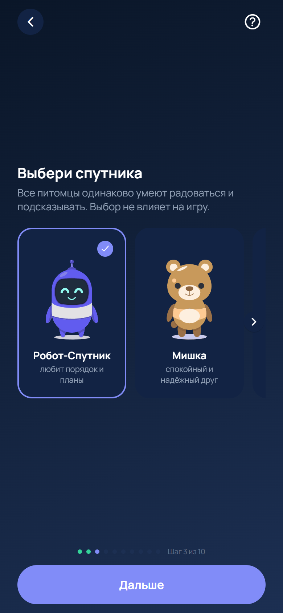
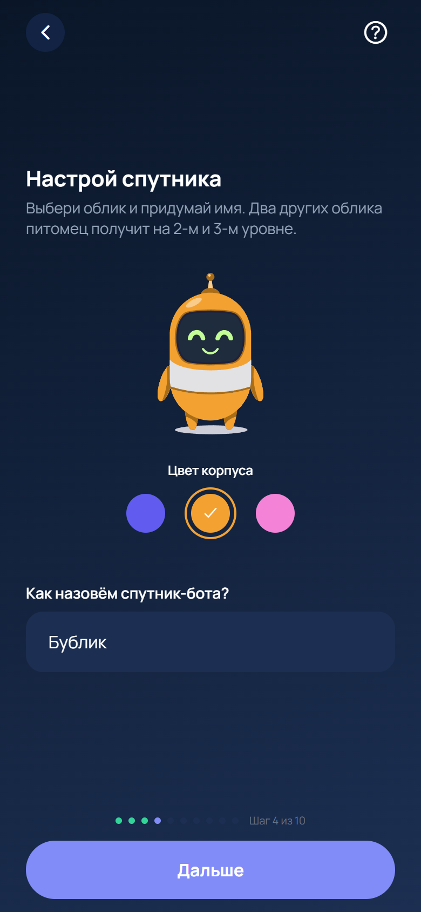

- **Три типа решений.** Второй шаг знакомства объясняет выбор, который встретится в игре: «Нужно», «Хочу», «Коплю».
- **Выбор спутника.** Робот, мишка или кот. Вид питомца на игру не влияет.
- **Настройка.** Один из трёх обликов и имя (от 2 символов). Вместе это 9 визуально различимых комбинаций. Два других облика питомец получит на уровнях 2 и 3.
- Профиль — только имя питомца и его облик. Ни имени ребёнка, ни телефона, ни e-mail.

## 5.2. Главный экран (ТЗ 2.5.3)

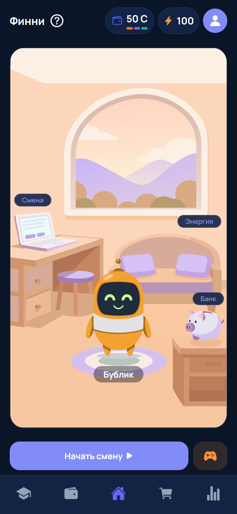
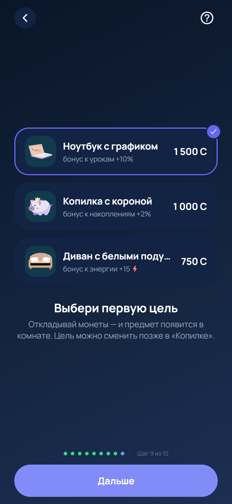

- Сверху — кошелёк «50 C» с декоративной трёхцветной полоской «надо / хочу / коплю», энергия ⚡ и вход в «Прогресс». Кнопка «?» открывает подсказку к экрану.
- Комната: питомец с именем, ноутбук («Смена» — открывает планирование), кровать («Энергия»), копилка («Банк» — открывает накопления).
- Кнопки: «Начать смену» (во время смены — «Продолжить смену» и сколько осталось) и Аркада. Нижние вкладки ведут в Уроки, Копилку, Магазин и Прогресс.
- Первую цель накоплений ребёнок выбирает ещё при знакомстве (второй снимок).
- **Планируется:** вывести на главный экран сумму накоплений с прогрессом к цели и название текущего урока. Сейчас они видны только во вкладках «Копилка» и «Уроки».

## 5.3. Бюджет: планирование, смена, итоги (ТЗ 2.5.5, 2.5.6, 2.5.9)

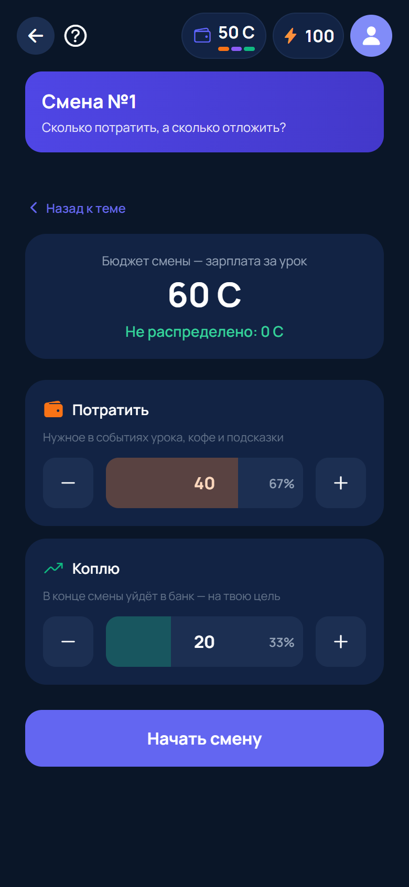
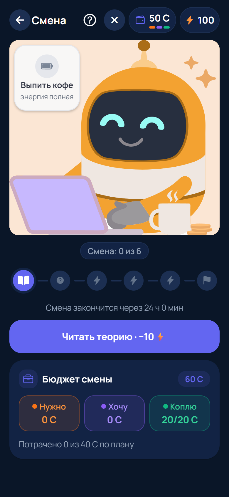
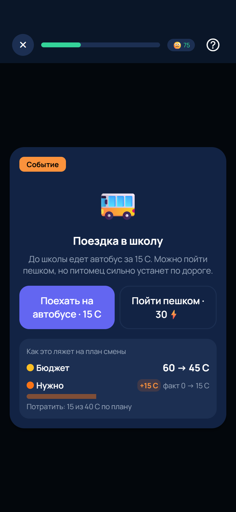

- **Планирование.** Зарплата за урок (60 C) делится до начала смены. Сумма не может превысить бюджет, остаток виден сразу («Не распределено: 0 C»), план можно менять до «Начать смену».
- **Смена.** Трек этапов урока, время до конца смены, цена этапа в энергии. Карточка «Бюджет смены» показывает факт по корзинам «Нужно», «Хочу», «Коплю» и строку «Потрачено 0 из 40 C по плану».
- **Событие.** Выбор с ценой: автобус за 15 C (обязательная трата) или пешком за 30⚡ энергии питомца. До выбора видно, как он ляжет на план: «Бюджет 60 → 45 C», «Нужно: факт 0 → 15 C».
- **Планируется:** третье направление в плане (разделить «Потратить» на «Нужно» и «Хочу») и короткое пояснение после выбора в событии.

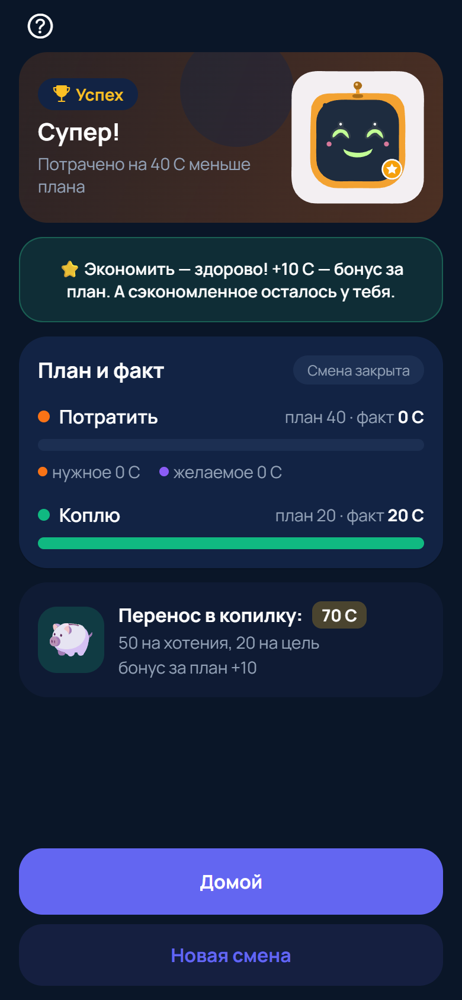
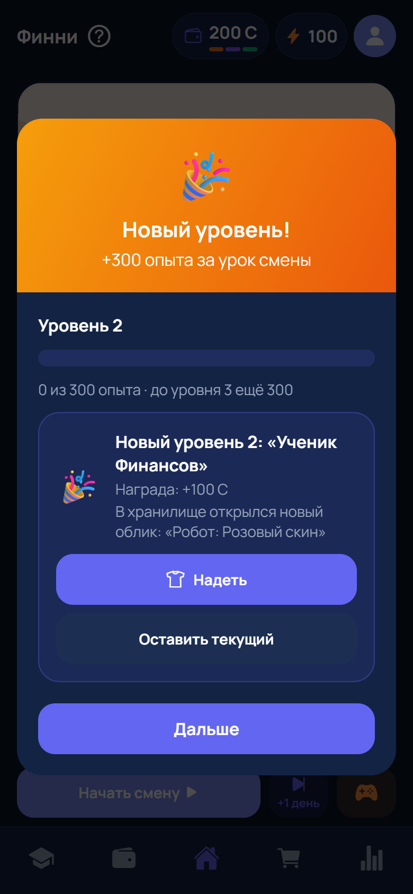

- **Итоги смены.** План и факт, бонус за план и выплата: «Коплю» уходит в копилку, остаток — в кошелёк. Экономия отмечается похвалой («Супер! Потрачено на 40 C меньше плана»), перерасход — подсказкой без упрёка («Траты вышли на N C больше плана — не страшно» и совет на следующую смену).
- **Опыт и уровень.** Новый уровень, награда и новый облик в хранилище с выбором «Надеть» / «Оставить текущий». Кнопка «Новая смена» начинает следующий игровой период.

## 5.4. Накопления и финансовая цель (ТЗ 2.5.7)

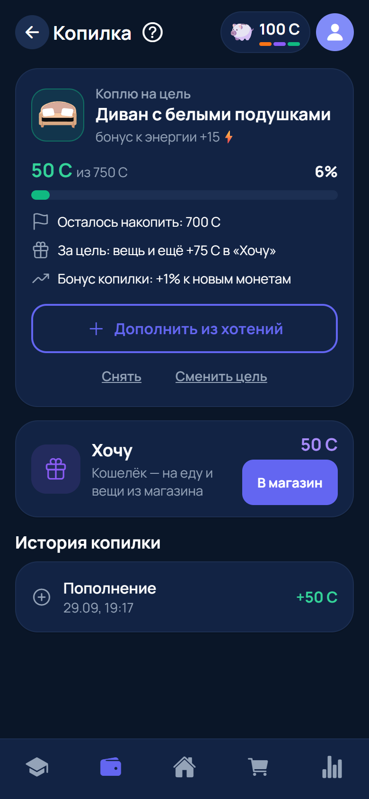
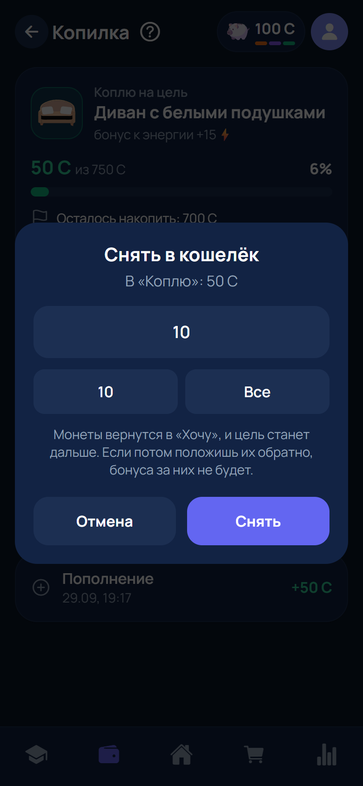

- **Копилка.** Цель, её стоимость, накоплено («50 C из 750 C · 6 %»), сколько осталось накопить, что дадут за цель и бонус копилки. Кнопки «Дополнить из хотений», «Снять», «Сменить цель», ниже — история копилки.
- **Снятие** проходит в отдельном окне с подтверждением и предупреждением «цель станет дальше». **Планируется:** показать до подтверждения «накоплено 50 → 40 C, до цели 700 → 710 C».

## 5.5. Другие экраны

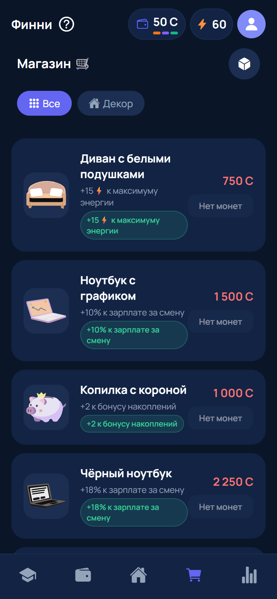
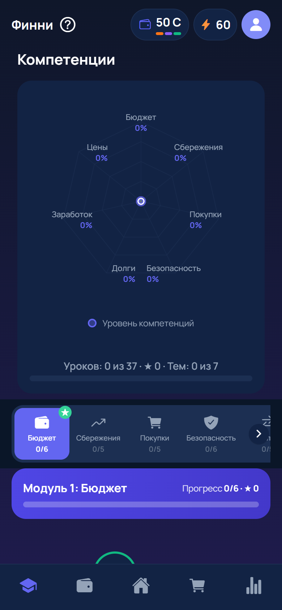
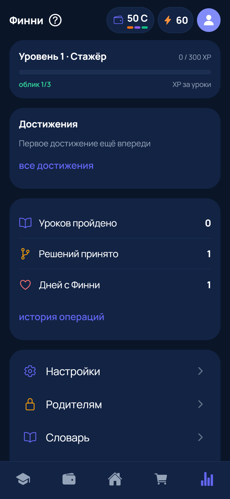
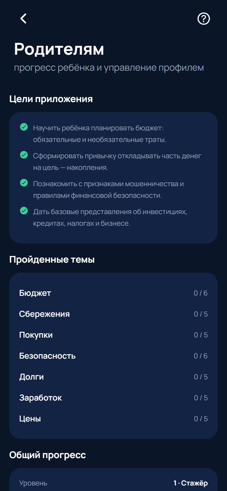

- **Магазин.** Цена, эффект вещи, кнопка покупки с подтверждением. Сейчас в магазине только необязательные вещи.
- **Уроки.** Матрица компетенций по 7 темам, дорожка уроков со статусами: ★ — без ошибок, ✓ — пройден, «Начат», «Следующий», замок.
- **Прогресс.** Уровень, достижения, статистика, история операций, настройки, раздел «Родителям», словарь.
- **Раздел для взрослого** (по PIN). Цели приложения, пройденные темы, общий прогресс, демо-режим, сброс и удаление профиля.
